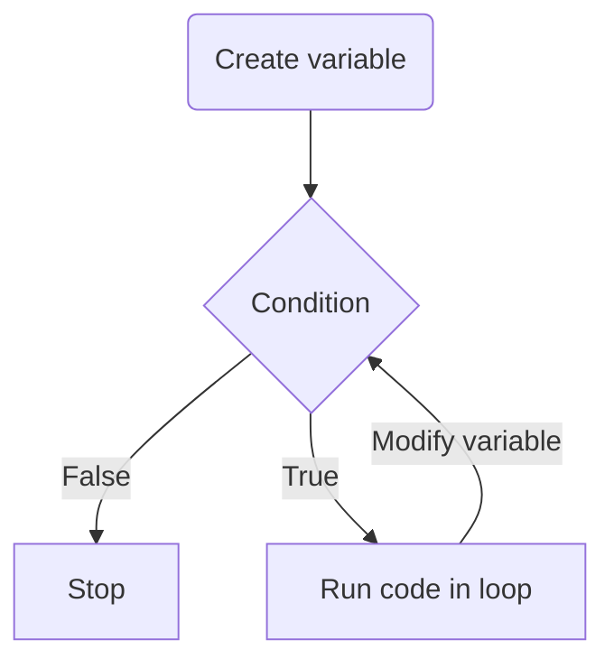

Imagine using while loops to repeat an action a certain number of times.

```java
public class Main {
    public static void main(String[] args) {
        int counter = 0;
        while (counter < 5) {
            System.out.println("Hello!");
            counter++;
        }
    }
}
```

In the end, all this code does is print out "Hello!" five times.

_Doesn't this code seem long to do something so simple?_

Well, that's why "for loops" exist. They turn all of that code above into a simple, one line statement. Here's the template:


So, if we wanted to print out "Hello!" five times like before, using the formula would look like this:


When this runs, Java creates your variable, then repeatedly checks your condition to see whether it should exit or update the variable.



And the final code would look like this:

```java
public class Main {
    public static void main(String[] args) {
        for (int i = 0; i < 5; i++) {
            System.out.println("Hello!");
        }
    }
}
```

That's *sooo* much shorter!
